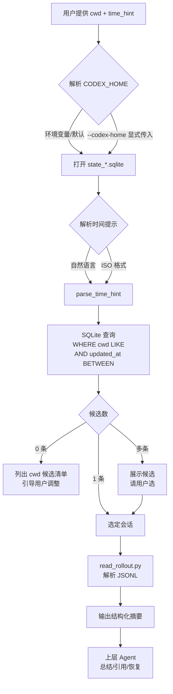

# skill-codex-session-locator

根据工作目录（cwd）和大致更新时间，定位本地 Codex CLI 会话并按需解析其完整对话内容。

## 项目简介

Codex CLI 的会话历史分散在 `state_*.sqlite`（索引）、`sessions/*.jsonl`（完整历史）和 `history.jsonl`（简略历史）三处。当用户只能记得「在某个项目目录下、某个大致时间跑过一次 Codex」时，本技能提供：

1. **会话定位**：以 cwd 关键字 + 时间窗口查询 `state_*.sqlite.threads`，返回候选列表
2. **会话读取**：解析 `rollout-*.jsonl` 文件，提取用户/助手消息与工具调用
3. **结构化输出**：以 JSON 或可读表格呈现，便于上层 Agent 总结与引用

适用于 Codex CLI 在 Windows + PowerShell 环境下的会话检索与回溯场景。

## 业务流程



## 文件目录结构

```text
skill-codex-session-locator/
├─ SKILL.md                    # 技能入口与工作流
├─ README.md                   # 本文件
├─ INSTALL.md                  # 本地安装与手动调用
├─ .env.example                # 环境变量示例
├─ .gitignore                  # Git 忽略规则
├─ scripts/
│  ├─ locate_session.py        # 按 cwd + 时间窗查 sqlite
│  └─ read_rollout.py          # 读取并解析 JSONL 会话文件
└─ references/
   ├─ codex-storage.md         # Codex 三种存储介质完整说明
   └─ sqlite-schema.md         # state_*.sqlite 表结构
```

## 获取与安装

### 方式一：从 GitHub 仓库拉取（推荐）

```powershell
git clone https://github.com/JasonCai2024/skill-codex-session-locator.git
```

将整个仓库目录放置到以下任一位置即可被 Claude Code / OpenCode 自动发现：

```text
.claude/skills/skill-codex-session-locator/        # 项目级
~/.claude/skills/skill-codex-session-locator/      # 全局
.opencode/skills/skill-codex-session-locator/     # OpenCode 原生
```

### 方式二：手动调用

详见 [INSTALL.md](./INSTALL.md)。

## 使用方式

### 在 Claude Code 中调用

```text
/skill-codex-session-locator 帮我找到昨天在 E:\vnpy-master 启动的那个 Codex 会话
```

### 直接运行脚本

```powershell
# 定位候选会话
python scripts/locate_session.py --cwd "E:\vnpy-master" --time "yesterday afternoon"

# 读取完整会话
python scripts/read_rollout.py --path "C:\Users\pc\.codex\sessions\2026\06\17\rollout-2026-06-17T09-45-22-<id>.jsonl" --summary

# 渲染指定 turn
python scripts/read_rollout.py --path "<rollout_path>" --turn 5

# 指定 CODEX_HOME
python scripts/locate_session.py --codex-home "C:\Users\pc\.codex\zero-taobao" --cwd "E:\vnpy-master" --time "2026-06-17"

# JSON 输出(供上层 Agent 消费)
python scripts/locate_session.py --cwd "vnpy" --time "last week" --json
```

### 支持的时间提示

| 输入 | 解析结果 |
|------|---------|
| `今天` / `today` | 今天 00:00 - 23:59（本地时区） |
| `昨天` / `yesterday` | 昨天全天 |
| `前天` / `day before yesterday` | 前天全天 |
| `N 天前` / `N days ago` | N 天前那天 |
| `上周` / `last week` | 7 天前那天 |
| `今天上午` / `this morning` | 6:00 - 12:00 |
| `昨天下午` / `yesterday afternoon` | 昨天 12:00 - 18:00 |
| `around 3pm` / `3pm 左右` | ±2 小时窄窗口 |
| `2026-06-17` | 整天 |
| `2026-06-17T15:00` | ±2 小时 |

## 凭证安全与隔离规范

- **不读取任何远程凭证**：本技能是纯本地 SQLite + JSONL 读取，不涉及网络请求
- **`CODEX_HOME` 可能包含敏感信息**：`state_*.sqlite` 中包含会话标题、首条用户消息、模型名等元数据；不要把整个 `~/.codex/` 加入仓库
- **脚本只读访问**：默认不会修改 `state_*.sqlite` 或 `sessions/*.jsonl`；如需修改标题，参考 `references/sqlite-schema.md` 第 7.4 节
- **多配置目录隔离**：用户可能有 `~/.codex/`（OAuth）和 `~/.codex/zero-taobao/`（API Key）等多个配置目录；本技能默认只查 `CODEX_HOME`，查询其他目录必须显式 `--codex-home`

## 核心设计决策

1. **Python 而非 PowerShell**：`scripts/` 用 Python 3 编写，跨平台、易测试、源文档也是 Python 示例；避免 PowerShell 5.1 ANSI 编码陷阱
2. **LIKE 子串而非精确匹配 cwd**：用户常记的是项目根目录而非精确路径；用 `LIKE %<keyword>%` 提高召回
3. **时间窗默认上限 30 天**：防止「忘了时间」导致扫描全表；超出时必须显式缩窄
4. **路径归一化**：用户可能输入 `E:/vnpy-master` 或 `E:\vnpy-master`，脚本内部统一为反斜杠
5. **跳过加密的 reasoning 字段**：Codex 的思考过程是加密的，无法解读，跳过避免误导
6. **零匹配时给出 cwd 候选清单**：用户常记错路径，列出数据库中实际出现过的 cwd 可加快定位
7. **多候选时不擅自挑选**：找到多条时必须让用户选；避免歧义

## 环境要求

- Python 3.8+
- Codex CLI（任何版本，会自动适配 `state_*.sqlite` 版本号）
- Windows / macOS / Linux 均可（cwd 路径按本地分隔符处理）

## 兼容性

- **Codex CLI**：所有使用 `state_*.sqlite` 索引的版本
- **Python**：3.8+（仅使用标准库 `sqlite3`、`argparse`、`json`、`dataclasses`、`datetime`、`pathlib`）
- **Mavis / Claude Code**：遵循 `ClaudeCode标准技能生成规范`，可被 Mavis 等上游系统通过 GitHub 仓库地址导入

## License

仓库内具体 License 待定（建议 MIT 或 Apache-2.0）。